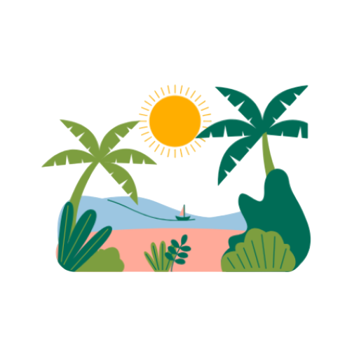
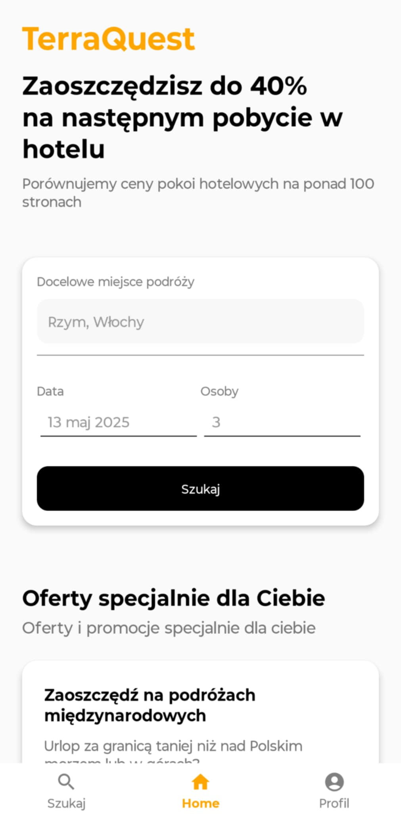
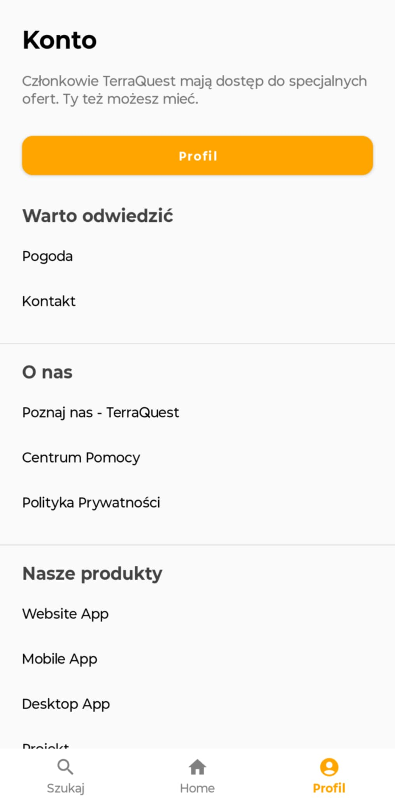

<div style="display: flex; align-items: center; gap: 10px;">
  
  <h1 style="color:gold; margin: 0;">TerraQuest</h1>
</div>

**TerraQuest_mobile** to natywna aplikacja na Androida będąca częścią ekosystemu TerraQuest – platformy wspomagającej planowanie podróży, zarządzanie atrakcjami turystycznymi oraz organizowanie wycieczek w Polsce i za granicą. Projekt ten powstał jako część pracy inżynierskiej studentów Zespołu Szkół Komunikacji w Poznaniu.

Aplikacja mobilna służy jako klient dla użytkowników, którzy chcą szybko i wygodnie odkrywać atrakcje turystyczne oraz tworzyć własne trasy podróży na smartfonie.

---

## 📲 Demo aplikacji



---

## 🧭 Główne funkcje

### 🔍 Odkrywanie atrakcji
- Przeglądanie listy atrakcji turystycznych.
- Filtrowanie wg kategorii (np. zamek, muzeum, góry).
- Widok szczegółowy atrakcji: opis, lokalizacja, zdjęcie, godziny otwarcia.

### 📌 Planowanie trasy
- Dodawanie atrakcji do planu podróży.
- Tworzenie i zarządzanie trasami.
- Podgląd trasy na mapie (Google Maps – planowane).

### 💬 Centrum pomocy (FAQ)
- System FAQ z wyszukiwarką i paginacją.
- Rozwijane odpowiedzi z animacjami.
- Intuicyjny i przejrzysty interfejs użytkownika.

### 🗂️ Profil użytkownika (planowane)
- Rejestracja i logowanie.
- Zapisywanie tras w chmurze.
- Historia wycieczek.

---

## 💡 Technologie

| Warstwa        | Technologie                         |
|----------------|-------------------------------------|
| Android UI     | XML Layouts, Fragments, RecyclerView|
| Backend lokalny| SQLite (AppDatabaseHelper)          |
| Język          | Java (min SDK 24)                   |
| Architektura   | MVP / częściowo MVVM                |
| IDE            | Android Studio                      |

---

# ⚙️ Instalacja
**📥 Krok 1 – Klonowanie repozytorium**
   ```bash
      git clone https://github.com/KolegaTatar/TerraQuest_mobile.git
   ```
**⬇️ Krok 2 – Przejście do projektu**
   ```bash
      cd TerraQuest_mobile/TerraQuest
   ```

# Podział pracy w projekcie TerraQuest

## Frontend:

- **activity_main.xml** [Każdy]
- **booking_item.xml** [Jacek]
- *faq_item.xml** [Jacek]
- *fragment_about.xml** [Filip]
- *fragment_contact.xml** [Filip]
- *fragment_explore.xml** [Wiktor]
- *fragment_help.xml** [Jacek]
- *fragment_home.xml** [Wiktor]
- *fragment_login.xml** [Filip]
- *fragment_pp.xml** [Filip]
- *fragment_product.xml** [Wiktor]
- *fragment_reg.xml** [Filip]
- *fragment_search.xml** [Wiktor]
- *fragment_user.xml** [Jacek]
- *fragment_user_menu.xml** [Wiktor]
- *fragment_weather.xml** [Filip]
- *hotel_item.xml** [Wiktor]
- *hotel_item2.xml** [Wiktor]
- *item_timeline_entry.xml** [Filip]
- *recenzja_item.xml** [Wiktor]
- *review_item.xml** [Wiktor]

---

## Backend:


---

## Baza danych:

- **AppDatabaseHelper.java**: [Każdy]
- **DatabaseHelper.java**: [Każdy]
- **UserDatabaseHelper.java**: [Każdy]

---

## Inne pliki

- **Styles, drawable, layout itd.**: [Każdy]

## Dokumentacja

- **Przygotowanie dokumentacji technicznej**: [Każdy]

---

# 🌐 Opis podstron / backendu

## Frontend:

# `activity_main.xml`
- **Opis**:  
  Główny layout aplikacji TerraQuest definiujący strukturę interfejsu użytkownika. Zawiera kontener na fragmenty oraz dolną nawigację.

- **Funkcje**:
    - `FrameLayout` o ID `fragment_container` służy do dynamicznego wyświetlania fragmentów aplikacji.
    - `BottomNavigationView` zapewnia dolne menu nawigacyjne z ikonami i etykietami.
    - Spójny styl i kolorystyka zgodna z motywem aplikacji.

---

# `booking_item.xml`

## Opis
Layout reprezentujący pojedynczy element rezerwacji w aplikacji. Przeznaczony do prezentacji podstawowych informacji o rezerwacji z możliwością rozwinięcia szczegółów. Stylizowany z użyciem zaokrąglonego tła i wewnętrznych marginesów dla estetyki i czytelności.

## Funkcje
- **Kontener główny**:  
  `RelativeLayout` z tłem `@drawable/rounded_edittext` i marginesami po bokach oraz od dołu.

- **Strzałka rozwijająca (`@+id/arrow_icon`)**:  
  `ImageView` umieszczony po prawej stronie, służący do rozwijania/zwijania szczegółów. Zawiera ikonę `@drawable/ic_arrow_down` i może być animowany poprzez rotację.

- **Kontener tekstu (`@+id/text_container`)**:  
  `LinearLayout` w układzie pionowym zawierający:

    - `TextView` `booking_title`:  
      Wyświetla tytuł elementu, np. nazwę hotelu. Pogrubiona czcionka, rozmiar 16sp.

    - `TextView` `booking_subtitle`:  
      Wyświetla podtytuł, np. adres. Rozmiar 14sp, kolor #666666.

    - **Sekcja cen** (`LinearLayout` poziomy):
        - `TextView` `booking_old_price`:  
          Poprzednia cena, kolor czerwony (#FF0000), odstęp od nowej ceny.
        - `TextView` `booking_new_price`:  
          Aktualna cena, pogrubiona.

    - `TextView` `booking_details`:  
      Szczegółowy opis rezerwacji, domyślnie ukryty (`visibility="gone"`), wyświetlany po rozwinięciu.

## Styl i UX
- Zaokrąglone rogi i padding zapewniają spójny, nowoczesny wygląd.
- Komponent gotowy do obsługi interakcji użytkownika (np. rozwijanie po kliknięciu).
- Może być używany w listach lub jako część większego widoku rezerwacji.

---

# `faq_item.xml`

## Opis
Layout pojedynczego elementu FAQ z tytułem i rozwijaną odpowiedzią. Stylizowany z zaokrąglonym tłem i ikoną strzałki do interakcji.

## Funkcje
- **Nagłówek (`RelativeLayout`)**:  
  Zawiera `faqTitle` (tekst pytania) oraz `arrowIcon` do rozwijania/zwijania treści.

- **Treść FAQ (`faqContent`)**:  
  Tekst odpowiedzi, domyślnie ukryty (`visibility="gone"`), pojawia się po rozwinięciu.

- **Stylizacja**:  
  Białe tło, padding wewnętrzny, spójny wygląd zgodny z resztą aplikacji.

---

# `fragment_about.xml`

## Opis
Widok przewijalny prezentujący sekcję „O nas” w aplikacji TerraQuest. Zawiera nagłówki, opisy, statystyki oraz oś czasu rozwoju aplikacji.

## Funkcje
- **Obraz nagłówkowy** (`headImage`) — ilustracja w górnej części widoku.
- **Sekcja misji** — żółte tło z tytułem i opisem misji firmy.
- **Opis aplikacji** — nagłówek „O TerraQuest” oraz charakterystyka aplikacji.
- **Statystyki** — cztery tekstowe pola (`textStatsLanguages`, `Apps`, `Countries`, `Hotels`) oddzielone liniami.
- **Oś czasu** (`timelineLayout`) — lista kroków historii aplikacji z użyciem layoutów `item_timeline_entry`.

## Stylizacja
Jasne kolory, przejrzysty układ, przewijalność dzięki `ScrollView`. Wyróżnione sekcje kolorem i paddingiem.

---

# `fragment_contact.xml`

## Opis
Ekran kontaktowy aplikacji TerraQuest z formularzem zapytania oraz danymi kontaktowymi.

## Funkcje
- **Obraz w nagłówku** (`TrapezoidImageView`) – dekoracyjna grafika kontaktowa.
- **Formularz kontaktowy** – pola: Imię, Nazwisko, Email, Wiadomość + przycisk `Wyślij`.
- **Dane kontaktowe**:
    - ☎ Telefon: `+48 517 086 440`
    - 📍 Adres: `Warszawa, ul. Powstańców 21A`
    - ✉ Email: `kontakt@terraquest.pl`

## Stylizacja
Zaokrąglone tła, padding, cień (`elevation`) oraz kolorystyka zgodna z brandingiem (pomarańcz i biel).

# `fragment_explore.xml`

## Opis
Ekran główny aplikacji TerraQuest – zawiera wyszukiwarkę hoteli, listę popularnych miejsc, formularz newslettera oraz oceny użytkowników.

## Sekcje i Funkcje

### 🎯 **Nagłówek promocyjny**
- Informacja o oszczędnościach (`TextView` z tytułem i podtytułem).

### 🔍 **Formularz wyszukiwania hoteli**
- **Miejsce podróży** (`input_destination`)
- **Data** (`editTextDate`)
- **Liczba osób** (`text_people`)
- Przycisk `Szukaj` (`button_search`)

### 🏨 **Popularne wyszukiwania**
- Tytuł + opis
- `RecyclerView` (`recyclerViewHotels`) – lista popularnych lokalizacji/hoteli

### 📨 **Newsletter**
- Sekcja z banerem i formularzem zapisu (`editTextEmail` + `buttonSubscribe`)

### 🌟 **Oceny klientów**
- Teksty promocyjne + `ViewPager2` (`reviewsViewPager`) z opiniami użytkowników

## Stylizacja
- Zaokrąglone przyciski i pola tekstowe (`@drawable/rounded_button`, `rounded_edittext`)
- Odcienie szarości (#757575), czerni i żółci dla kontrastu
- Marginesy wewnętrzne 24dp dla spójności

---

# `fragment_help.xml`

## Opis
Ekran pomocy użytkownika z możliwością przeszukiwania najczęściej zadawanych pytań (FAQ). Zawiera pole wyszukiwania, dynamicznie ładowane odpowiedzi i prostą paginację.

## Sekcje i Funkcje

### 👋 **Nagłówek powitalny**
- `TextView` (`helpTitle`) – zachęcający komunikat: _"Cześć, jak możemy Ci pomóc?"_

### 🔎 **Wyszukiwanie FAQ**
- `EditText` (`searchInput`) – pole tekstowe z podpowiedzią: _"Wyszukaj pytanie"_
- *(Opcjonalny przycisk `searchButton` – zakomentowany, można przywrócić jeśli potrzebny)*

### 📋 **Lista FAQ**
- `ScrollView` zawierający `LinearLayout` (`faqContainer`) – kontener na dynamicznie dodawane pytania/odpowiedzi

### 🔄 **Paginacja**
- `LinearLayout` (`paginationContainer`) z dwoma przyciskami:
    - `prevButton` – przejście do poprzedniej strony
    - `nextButton` – przejście do kolejnej strony

## Styl i UI
- Minimalistyczny, czytelny układ z dużymi marginesami bocznymi (`24dp`)
- Użycie niestandardowego tła i zaokrąglonych elementów (`@drawable/rounded_edittext`)
- Przejrzysty podział na nagłówek, wyszukiwarkę, wyniki i nawigację

---

# `fragment_home.xml`

## 📱 Opis
Ekran startowy aplikacji TerraQuest, umożliwiający użytkownikowi wprowadzenie danych podróży: miejsca docelowego, daty oraz liczby osób. Zawiera także sekcję promującą oszczędności i porównywanie ofert.

## 📋 Zawartość widoku

### 🔶 Nagłówek i opis
- **`TextView`: TerraQuest**  
  Nazwa aplikacji, stylizowana na pomarańczowo (`@color/orange`) z dużym rozmiarem (`35sp`)
- **Opis promocyjny**  
  Informacje o potencjalnych oszczędnościach i funkcji porównywania ofert

### 📥 Formularz wyszukiwania (w `card_background`)
- **`Docelowe miejsce podróży`**
    - `EditText` (`input_destination`) z podpowiedzią (hint): _"Rzym, Włochy"_
- **Separator (`View`)**
    - Cienka linia oddzielająca pola formularza
- **`Data`** (`editTextDate`) – zablokowane pole, domyślnie nieedytowalne, do otwierania np. `DatePickerDialog`
- **`Osoby`** (`text_people`) – pole liczby uczestników

## 🎨 Styl i układ
- Użycie `ScrollView` zapewnia przewijalność na mniejszych ekranach
- Wszystkie główne pola i opisy mają boczne marginesy `24dp` dla spójnego layoutu
- `LinearLayout` z `weightSum="2"` umożliwia estetyczne ułożenie pól **Data** i **Osoby** obok siebie
- Pola `EditText` mają ustandaryzowaną wysokość `48dp` i padding `12dp`, zapewniając wygodę dotykową
- Formularz otoczony kartą (`@drawable/card_background`) z cieniem (`elevation="4dp"`)

---

# `fragment_login.xml`

## 📱 Opis
Ekran logowania użytkownika do aplikacji TerraQuest, z prostym i estetycznym układem zawierającym logo, pola do wpisania e-maila i hasła oraz przyciskiem logowania. Na dole znajduje się link do rejestracji oraz separator "lub".

## 📋 Struktura widoku

### Nagłówek z logo
- **`ImageView`** (`logoImage`) – logo aplikacji (`@drawable/tq_logo`), wymiar 120x120dp
- **`TextView`** (`logoText`) – nazwa aplikacji "TerraQuest", kolor pomarańczowy (`@color/orange`), duża czcionka (`35sp`), pogrubiona

### Formularz logowania (`LinearLayout` z tłem `@drawable/rounded_input`)
- **Tytuł** – `TextView` z napisem "Zaloguj się", wyśrodkowany, rozmiar 28sp
- **E-mail**
    - `TextView` z etykietą "Email"
    - `EditText` (`emailInput`) do wpisania adresu e-mail, podpowiedź "Podaj email", typ `textEmailAddress`
- **Hasło**
    - `TextView` z etykietą "Hasło"
    - `EditText` (`passwordInput`) do wpisania hasła, podpowiedź "Podaj hasło", typ `textPassword`
- **Przycisk logowania**
    - `Button` (`loginButton`) z napisem "Zaloguj się", styl `@style/Log_reg_btn`, ciemny kolor tła (#333333)

### Separator „lub”
- Dwa cienkie paski po bokach `View` (1dp wysokości), szary kolor (#888888)
- W środku tekst "lub" w tym samym odcieniu szarości

### Link do rejestracji
- `TextView` (`registerLink`) z napisem "Zarejestruj się", pogrubiony, czarny tekst, rozmiar 14sp

## 🎨 Styl i układ
- Całość zawinięta w `ScrollView`, aby obsłużyć przewijanie na mniejszych ekranach
- Elementy centrowane horyzontalnie (`gravity="center_horizontal"`)
- Spójne marginesy boczne (`24dp`) i odstępy między elementami
- Zaokrąglone tło formularza (`@drawable/rounded_input`) poprawia estetykę i komfort użytkowania
- Przycisk logowania ma wyraźne tło i styl zdefiniowany w pliku stylów

---

# `fragment_pp.xml`

## 📄 Opis
Ekran z pełnym tekstem Polityki Prywatności aplikacji TravelQuest. Tekst jest podzielony na sekcje, które jasno wyjaśniają zasady przetwarzania danych osobowych użytkowników.

## 🏗️ Struktura widoku

- Główny kontener to `ScrollView` z tłem ustawionym na kolor `@color/background_main` i paddingiem po bokach.
- Wewnątrz `ScrollView` znajduje się `LinearLayout` (pionowy), który zawiera całą treść polityki.
- Tekst jest podzielony na nagłówki (`TextView` ze stylem `@style/AboutTextH`) i akapity (`TextView` ze stylem `@style/AboutTextp`).
- Tytuł ekranu "Polityka Prywatności" jest wycentrowany, pogrubiony i większy (`24sp`).
- Data wejścia w życie i ostatnia aktualizacja są podane pod tytułem z odstępem.
- Treść polityki jest szczegółowa i sformatowana w punktach, często z użyciem znaków „✓” dla list.

## 🖋️ Style

- `@style/AboutTextH` — styl nagłówków rozdziałów (prawdopodobnie pogrubiony, większa czcionka)
- `@style/AboutTextp` — styl paragrafów (czytelna czcionka, standardowy rozmiar i kolor)
- Kolory tekstu są spójne, głównie ciemne (`#333333`, `@color/black`), co poprawia czytelność.

---

## Backend:


---

## Baza danych:

# `AppDatabaseHelper.java`
- **Opis**:  
  Klasa pomocnicza do zarządzania lokalną bazą danych SQLite w aplikacji TerraQuest. Odpowiada za tworzenie i aktualizację struktury bazy danych oraz inicjalizację danych startowych (recenzje i artykuły pomocy).

- **Funkcje**:
    - Tworzenie tabel:
        - `users` – dane użytkowników (email, hasło, imię, nazwisko, newsletter)
        - `reviews_terraQuest` – recenzje obiektów
        - `help` – sekcja pomocy z pytaniami i odpowiedziami
        - `reservation` – informacje o rezerwacjach z kluczem obcym do użytkownika
        - `date` – dodatkowe dane z oznaczeniem typu i wartości
    - Wstawianie początkowych danych do tabel `reviews_terraQuest` i `help`
    - Obsługa aktualizacji wersji bazy (`onUpgrade`)
    - Zapewnienie spójności danych (np. unikalność adresów e-mail)

---

# `DatabaseHelper.java`
- **Opis**:  
  Prosta klasa pośrednicząca do obsługi lokalnej bazy danych w aplikacji TerraQuest. Ułatwia dostęp do metod odczytu i zapisu, wykorzystując `AppDatabaseHelper`.

- **Funkcje**:
    - Inicjalizacja pomocnika bazy danych (`AppDatabaseHelper`)
    - Udostępnienie metod:
        - `getReadableDatabase()` – uzyskanie instancji bazy danych tylko do odczytu
        - `getWritableDatabase()` – uzyskanie instancji bazy danych z możliwością zapisu

---

# `UserDatabaseHelper.java`
- **Opis**:  
  Klasa pomocnicza odpowiedzialna za dostęp do bazy danych użytkowników w aplikacji TerraQuest. Działa jako pośrednik, wykorzystując `AppDatabaseHelper`.

- **Funkcje**:
    - Inicjalizacja obiektu `AppDatabaseHelper`
    - Udostępnienie metod:
        - `getReadableDatabase()` – otwiera bazę danych w trybie tylko do odczytu
        - `getWritableDatabase()` – otwiera bazę danych w trybie do zapisu

---

## Makieta projektu - Figma:
Opis:
Makieta projektu w Figma to wizualne odwzorowanie interfejsu użytkownika aplikacji lub strony internetowej. Dokumentacja ta przedstawia sposób korzystania z makiety w Figma, jej cele, funkcje oraz strukturę, jak również zapewnia informacje dotyczące współpracy zespołowej i organizacji projektu w Figma.

https://www.figma.com/design/VAEeMmg1rGRkZhTuEwuFnK/Platforma-do-Planowania-Podróży-i-Rezerwacji---TerraQuest?node-id=0-1&t=TFYAgNNcLLNpHKD8-1
---